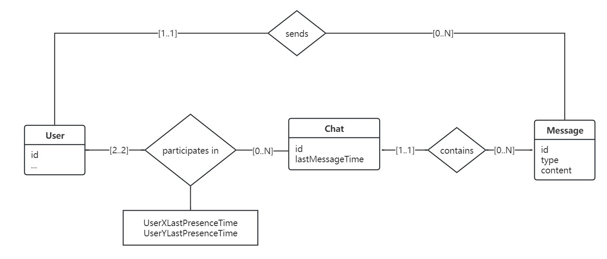
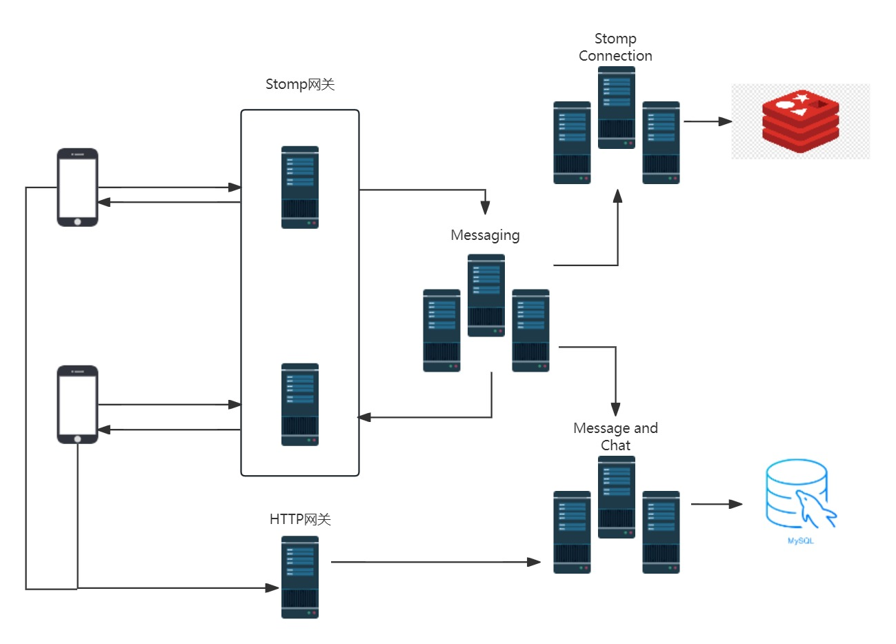

# chat模块的架构设计

## 功能特性

- 用户之间一对一即时聊天
- 离线留言
- 云端永久保存聊天记录
- 图片和文件共享

## 数据库模式设计

- 关系数据库的实体集和关系集模式
  
- Redis用户连接数据模式
  

## 系统设计



## 服务集群中的各个源码项目

- chat-commons：数据原型和相关工具，即entity, dto, vo, enum, util
- chat-inner-api：内部接口类，目前拟定是RPC接口，供消费者引入和注入，提供者引入和实现
- chat-websocket-gateway：Stomp网关，对外的Stomp API端点都在这里
- chat-http-gateway：HTTP网关，对外的HTTP API端点都在这里
- chat-stomp-connection-service：连接服务，维护用户-Stomp网关IP:port的关系和用户在线状态的数据库（Redis），提供内部接口
- chat-messaging-service：路由服务，提供内部接口和Rest接口供网关调用，同时协调调用其他服务和Stomp网关的内部接口
- chat-chat-service：聊天服务，管理聊天资源，提供相关内部接口和Rest接口
- chat-message-service：消息服务，管理消息资源，提供相关内部接口和Rest接口

## 前端应用中的源码模块

- 全局数据管理模块，维护聊天功能的相关状态
  - 用户当前在哪个页面
  - 消息页面的相关数据
  - 聊天页面的相关数据

    ```javascript
    {
        userIsCurrentlyOnPage: "chat",
        // 或 "message", 或 "others"
        // 有对应的getter和setter, 一般在页面的钩子里调用
        // 用户在chat页 <=>  userIsCurrentlyOnPage === "chat"
        // 用户在message页 <=>  userIsCurrentlyOnPage === "message"

        messagePageChatId: "chatId",
        // 值为-1时表示无效
        messages: [],
        // 按时序的某个聊天的消息
        // 有append方法，用于追加一段近期聊天
        // 由appendFromStomp方法
        messagesRequest: {
          current: 1,
          pageSize: 20,
          beforeTime: "",
        },
        // HTTP请求体，用于请求message[0]之前的一页消息，beforeTime === message[0].createTime 一直成立
        enableStompMessageAppending: true,
        stompMessageBuffer: [],
        // HTTP请求方法会禁用Stomp消息中聊天消息的追加，等HTTP请求完成并追加完成后再启用
        // 当Stomp追加被禁用时，消息先进缓冲区
        // 最后再由HTTP请求的回调将缓冲区追加到messages，同时清空缓冲区

        chats: [],
        chatsRequest: {
          current: 1,
          pageSize: 20,
          sortField: "lastMessageTime",
          sortOrder: "descend"
        }
        // 用户按最后新消息时间倒序排的一页聊天

        tabbarLabel: "true",
        // 这个是一个可以直接设置的属性
        // tabbar是否提示新消息，还需要结合chats的复合计算属性
        // 两者优先级和一些限制如下：
        // tabbarDisplaysNotReadLabel = tabbarLabel ? tabbarLabel : computedFromChats
        // 且每次chats刷新时，会将tabbarLabel置为false
    }
    ```

- 调用上述模块更新数据，且对于这些数据进行UI响应的UI组件
  - chat聊天（聊天列表）页面
  - message消息（具体的某个聊天）页面
  - tabbar

## 端到端业务流程

---

- 应用启动时且在用户登录后，前端发起请求，与某个Stomp网关的/ws端点建立Stomp连接，接下来是建立连接后立刻做什么，onConnect
  - 连接建立时
    - 前端发送以下消息到/app/user-connect端点
  
      ```json
      {
          "userId": "userId"
      }
      ```

    - 网关接收到消息，取出自身的ip和port，调用连接服务的setOnline，传入以下对象到连接服务为用户创建或更新连接，并修改用户状态为上线

      ```json
      {
          "userId": "userId",
          "ip": "ip",
          "port": "port"
      }
      ```

  - 连接建立时
    - GET自用户上一次离线之后的是否有未读消息

      ```json
      {
          "userId": "userId"
      }
      ```

    - http网关接收到消息，转发给聊天服务
    - 聊天服务查询并返回该用户是否有未读消息
  
      ```javasript
      {
          true / false
      }
      ```

    - 如果有新消息，前端依据用户在哪个页面更新UI
      - 若在others, 则更新tabbar
      - 若在chat，则刷新chat
      - 若用户在message
        - 若该message的chatId无新消息，则不更新
        - 否则，刷新message
  - 连接建立时，前端订阅网关的/user/${username}/queue/message端点，并传入onMessage回调，准备实时接受消息

---

- 当前端从/user/${username}/queue/message端点收到消息，onMessage
  - 消息形式为
  
    ```javascript
    {
        message: {...} (其中有chatId)
    }
    ```

  - 前端根据用户在哪个页面进行界面更新
    - 若用户在others，则更新tabbar，提示有新消息
    - 若用户在chat，则直接刷新chat（可以优化）
    - 若用户在message
      - 若该message的chatId和新消息chatId不匹配，更新tabbar
      - 否则，立刻更新到message的界面上，即通过appendFromStomp方法添加到messages数组的最后面

---

- 初次加载和之后每次显示chat页面，以及下拉刷新该页面时
  - 更新userIsCurrentlyOnPage为chat
  - 前端发http请求向后端分页请求这个用户的聊天视图，代替全局数据的chats数组
  - 将tabbarLabel置为false
  
    ```javascript
    [
        {
            ...chat,
            thereAreNewMessages: true
        },
        ...
    ]
    ```

- 每次退出或者隐藏页面时，更新userIsCurrentlyOnPage为others

---

- 初次加载和之后每次显示聊天页面
  - 通过一个数据模块的方法请求新的聊天数据
  设置enableStompMessageAppending为false，请求聊天数据，渲染页面，处理Stomp消息缓冲区，再设置enableStompMessageAppending为true
  - 然后（then）更新用户在这个聊天中的最后活动时间
    向后端发送

    ```json
    {
      "userId": "userId",
      "chatId": "chatId"
    }
    ```

    后端一般是以一个一般的更新类DTO对象来接收，然后查询聊天室并更新时间戳
- 每次退出或者隐藏页面时，更新userIsCurrentlyOnPage为others，清除chatId

- 每次用户发送聊天消息时
  - 前端向/app/chat发送Stomp消息，然后将消息直接appendFromStomp到message的末尾
  - 发送的Stomp消息体的具体格式为

    ```javascript
    {
      id: -1,
      type: "text",
      content: "content",
      senderId: "1234",
      chatId: "2134",
      recieverId: "1234"
    }
    ```

  - Stomp网关接收到消息，直接转发到转发服务
消息转发服务查询连接会话
若不在线则不转发，否则立刻转发
同时，
调用消息服务、对话服务、中转服务进行存储

---

- 用户注销或者应用关闭时
  - 前端发消息到/app/user-disconnect端点，网关接收消息后，调用连接服务的setOffline，传入userId，修改用户在线状态为下线
  - 同时，前端断开Stomp连接
