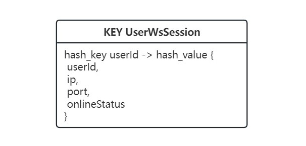

# chat模块的设计和实现

## 功能特性

- 用户之间一对一即时聊天
- 离线留言
- 云端永久保存聊天记录
- 图片和文件共享

## 数据库模式设计

- 关系数据库的实体集和关系集模式
  
  - User的表、实体类和相关数据类以及业务代码，在主模块已经都有了，在这里先简写一下，只写id
  - 关于Chat实体和关系的说明：&nbsp;
    lastMessageTime是该对话最近最新的一条消息的创建时间，每次有新消息都要更新一下&nbsp;
    最终的Chat表会有userxId和useryId，以及相对应的userxLastPresentTime和useryLastPresentTime
  - 关于Message实体和关系的说明：
    type目前拟定有text，image和file，text类型对应的content为消息的文本内容，后两者对应的content为文件的url
    每条message必须同时有一个sender和一个所归属的chat
- Redis用户连接数据模式
  

## 系统设计


## 服务集群中的各个主要源码项目

- chat-commons：数据原型和相关工具，entity, dto, vo, enum, util, exception
- chat-inner-api：内部接口类，目前拟定是使用RPC接口，供消费者引入和使用，提供者引入和实现
- chat-stomp-gateway：Stomp网关，对外的Stomp端点都在这里
- chat-http-gateway：HTTP网关，对外的HTTP Rest端点都在这里
- chat-stomp-connection-service：Stomp连接服务，维护（用户-Stomp网关IP:port）的关系和用户在线状态的数据库（Redis），提供内部接口
- chat-messaging-service：传送服务，提供内部接口供Stomp网关调用，同时协调调用其他服务，以及调用Stomp网关的内部接口用于消息发送
- chat-chat-service：聊天服务，管理聊天资源，提供相关内部接口
- chat-message-service：消息服务，管理消息资源，提供相关内部接口（很可能会和chat-service合为一个微服务）

## 前端应用中的源码模块

- 全局数据管理模块（Vuex），维护聊天功能的相关状态
  - 用户当前在哪个页面
  - 消息页面的相关数据
  - 聊天页面的相关数据

    ```javascript
    {
        userIsCurrentlyOnPage: "chat",
        // 或 "message", 或 "others"
        // 有对应的getters和actions, 在页面的钩子和Stomp模块里调用
        // 用户在chat页 <=>  userIsCurrentlyOnPage === "chat"
        // 用户在message页 <=>  userIsCurrentlyOnPage === "message"


        senderId: 123,
        recieverId: 123,
        chatId: 123,
        // 各种id值为-1时表示无效
        messageToSend: {
          type: "text",
          content: "消息内容"，
          senderId: 123,
          recieverId: 123,
          chatId: 123
        }
        // messageToSend不在store里，而在页面中，和页面上的输入双向绑定（v-model）。
        // 新消息会在各个前端被给定一个lodash生成临时id
        // 这是因为后端的存储和转发是理论上解耦合的，转发时不一定存了，之后通过HTTP请求时才会获得后端的id
        // 不能将一个前端的id传给另一个前端，可能会重复
        messages: [],
        // 按时序的某个聊天的消息
        // 有append方法，用于追加一段近期聊天
        // 有appendFromStomp方法
        messagesRequest: {
          current: 1,
          pageSize: 20,
          beforeTime: "",
        },
        // HTTP请求体，用于请求message[0]之前的一页消息，beforeTime === message[0].createTime 一直成立
        enableStompMessageAppending: true,
        stompMessageBuffer: [],
        // HTTP请求方法会禁用Stomp消息中聊天消息的追加，等HTTP请求完成并追加完成后再启用
        // 当Stomp追加被禁用时，消息先进缓冲区
        // 最后再由HTTP请求的回调将缓冲区的消息筛选后追加到messages，同时清空缓冲区

        chats: [],
        chatsRequest: {
          current: 1,
          pageSize: 20,
          sortField: "lastMessageTime",
          sortOrder: "descend"
        }
        // 用户按最后新消息时间倒序排的一页聊天

        tabbarLabel: false,
        // 这个是一个可以直接设置的属性
        // tabbar是否提示新消息，还需要结合chats的某个计算属性
        // 两者优先级和一些限制如下：
        // tabbarDisplaysNotReadLabel = tabbarLabel ? tabbarLabel : computedFromChats
        // 且每次chats刷新时，会将tabbarLabel置为false
    }
    ```

- 调用上述模块更新数据，且不断读取这些数据进行UI更新的UI组件
  - chat聊天（聊天列表）页面
  - message消息（具体的某个聊天）页面
  - tabbar

## 端到端业务流程

---

- 应用启动且用户登录后，前端发起请求到某个Stomp网关的/ws端点，鉴权通过后，与网关建立Stomp连接。以下是建立连接后，前端立刻需要做什么，类似于一种onConnect回调：
  - 连接建立后
    - 前端发送以下消息到/app/user-connect端点，这里后端直接用一个专门传各种id的DTO IdRequest来接收
  
      ```json
      {
          "id": "userId"
      }
      ```

    - 网关接收到消息，取出自身的ip和port，远程调用连接服务的setUserStompConnection，传入包含以下信息的UserStompConnection对象到连接服务为用户创建或更新连接，并修改用户状态为上线，用户现在就算在线

      ```json
      {
          "userId": "userId",
          "ip": "ip",
          "port": "port"
      }
      ```

  - 连接建立后
    - 请求HTTP网关GET“自用户上一次离线之后，是否有未读消息”，/api/chat/unread

      ```json
      {
          "id": "userId"
      }
      ```

    - HTTP网关接收到消息，转发给聊天服务做查询
    - 聊天服务查询：
      查询该用户参与的所有聊天，对比该用户最后活跃时间和聊天的最新消息时间，若有任何一个活跃小于最新，则是true，否则false
    - 返回该用户是否有未读消息
  
      ```javasript
      {
          true / false
      }
      ```

    - 如果有新消息，前端依据用户在哪个页面更新UI
      - 若在others, 则**直接**更新tabbar徽标
      - 若在chat，则刷新chat
      - 若用户在message（？这种情况暂不考虑和实现）
        - 若该message的chatId无新消息，则不更新
        - 否则，刷新message
  - 连接建立后，前端订阅网关的/user/${username}/queue/message端点，传入onMessage回调，准备实时接受消息

---

- 当前端从/user/${username}/queue/message端点收到消息，onMessage所做的事：
  - 后端的消息形式为如下，其中chatId可能不存在，因为一个对话的史上第一条消息是直接从消息服务转发过来的，而消息服务从前端拿到的消息不会有chatId，还没创建。也没有message本身的id，所以需要给message添加在本前端的临时id。
  
    ```javascript
    {
        type: "text",
        content: "消息内容",
        senderId: 123,
        recieverId: 123,
        chatId: 123
    }
    ```

  - 前端根据用户在哪个页面进行界面更新
    - 若用户在others，则**直接**更新tabbar，提示有新消息
    - 若用户在chat，则直接刷新chat，此时无论是新的对话还是老的对话，都会被刷出来，chatId也会有
    - 若用户在message
      - 若该message的chatId和新消息chatId不匹配（或者chatId不存在，但是senderId和reciverId与当前message页的“无关”），**直接**更新tabbar
      - 否则，立刻更新到message的界面上，即通过appendFromStomp方法添加到messages数组的最后面

---

- **初次加载**和之后**每次显示**chat页面，以及**下拉刷新**该页面时
  - 更新userIsCurrentlyOnPage为chat
  - 将tabbarLabel置为false
  - 前端发起HTTP请求，向后端分页请求这个用户的聊天视图，直接代替（set）当前chats数组的内容
  - 后端HTTP网关用ChatController中的listChatVOsByPage端点接受这个请求，DTO为ChatQueryRequest
  - 网关立刻RPC转交给聊天服务listChatVOsByPage，直接传入ChatQueryRequest，该服务选出包含该用户的所有chats，然后检验是否有新消息，构成ChatVo数组如下返回
  
    ```javascript
    [
        {
            id: 123,
            theOtherUser: {},
            lastMessageTime: "12341",
            lastMessage: "content",
            thereAreNewMessages: true
        },
    ]
    ```

- 每次退出或者隐藏页面时，更新userIsCurrentlyOnPage为others

---

- **初次加载**和之后**每次显示**message页面，以及**下拉刷新**该页面时
  - 通过一个数据模块的方法请求新的聊天数据，这个方法具体做以下计算：
  设置enableStompMessageAppending为false
  尝试请求聊天数据并渲染页面，并更新请求中的beforeTime
  尝试更新用户在这个聊天中的最后活动时间
  处理异常
  最后处理Stomp消息缓冲区，再设置enableStompMessageAppending为true
  各项更细的操作如下：
    - 向后端请求聊天数据
      - 前端用的是HTTP网关MessageController里的listMessageVOsByPage端点，传入MessageQueryRequest DTO，这个DTO主要是为了传入senderId, recieverId（以及可选的chatId）还有beforeTime，第一次请求的beforeTime可以为空

        ```java
        public class MessageQueryRequest extends PageRequest {
            private Long chatId;
            private Long senderId;
            private Long receiverId;
            private Date beforeTime;
            private Long id;
            private String type;
            private String content;
        }
        ```

      - 网关基本上是直接转交聊天和消息服务，消息服务做的事情是，如果DTO没有chatId，则根据sender和reciever尝试查询chatId，若查不到直接返回空；如果有chatId，则根据chatId查询消息第一页并返回。消息的第一页指的是，符合条件的消息ORDER BY createTime DESCEND LIMIT pageSize后的数据的逆序（它们将被插入视图数组messages的开头）。
      - MessageVO的具体形式：

        ```java
        public class MessageVO {
            private Long id;
            private Date createTime;
            private String type;
            private String content;
            private Long chatId;
            private Long senderId;
        }
        ```

    - 更新用户在这个聊天中的最后活动时间，ChatController, updateLastPresentTime, 向后端发送UpdateLastPresentTimeDTO, 后端查询聊天室并更新时间戳

      ```java
      public class UpdateLastPresentTimeDTO {
          private Long id;
          /**
           * 更新这个用户的最后活动时间
           */
          private Long thisUsersId;
          // 这个只是在没有chatId时帮助查询
          private Long theOtherUsersId;
      }
      ```

- 每次退出或者隐藏页面时，
  - 更新userIsCurrentlyOnPage为others
  - 清除chatId, 即设置chatId为-1，清空各类缓冲区等等，总之，把message模块里的数据都变回初始化后的状态
  - 更新用户最后活跃时间

- 每次用户发送聊天消息时
  - 前端向/app/chat端点发送Stomp消息，然后将消息直接appendFromStomp到messages的末尾
  - 发送的Stomp消息体的具体格式MessageAddRequest如下，其中，senderId和recieverId必填，chatId为选填（这里，前端必须为消息生成一个不同于后端即将生成的、在前端唯一的key作为message的临时id,传给v-for）

    ```javascript
    {
        type: "text",
        content: "消息内容",
        senderId: 123,
        receiverId: 123,
        chatId: 123
    }
    ```

  - Stomp网关接收到消息，直接转交给到传送服务
    传送服务远程连接会话的getUserStompConnection业务方法获取UserStompConnection
    若接收者在线则转发，否则不转发，转发主要是设置ip和port，然后调用Stomp网关的sendMessage业务方法，传入MessageAddRequest，由网关路由到对应destination
    同时，传送服务调用对话和消息服务进行存储，若会话不存在则创建会话，更新会话的最后消息时间，存储消息

---

- 用户注销或者应用关闭时
  - 前端使用IdRequest发消息到/app/user-disconnect端点，网关接收消息后，调用连接服务的setOffline，最终传入userId，修改用户在线状态为下线
  - 同时，前端断开Stomp连接
